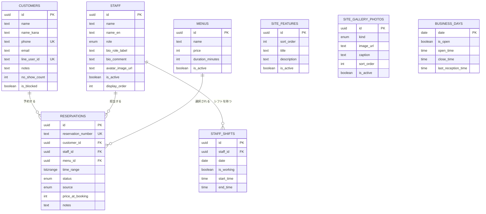

# City Dogs 予約管理システム — データモデル設計 (MVP)

対象規模: 固定客500人程度、同時アクセスはほぼなし。過剰設計を避け、DDLは [../supabase/migrations/0001_init.sql](../supabase/migrations/0001_init.sql) にそのまま起こせる粒度でまとめている。ER図は [er-diagram.html](./er-diagram.html) をブラウザで開くと見られる(下記コードでも同一内容)。

## ER図



`BUSINESS_DAYS` は `date` を通じて予約の空き枠計算に使うが、外部キーでは結んでいない(予約時にその日の営業時間を参照するだけの論理的な関係)。

## エンティティ

### customers(顧客)
氏名・電話番号を主キー代わりに使う想定(電話予約が主のため)。`no_show_count` / `is_blocked` は、無断キャンセルが続く顧客への対応(次回は電話確認必須、など)を運用側で判断するための材料。`email`はWeb予約時に必須入力とし、予約の確認・変更・キャンセルリンクの送信先として使う(顧客アカウント制の代わりの設計。詳細は「6. 顧客ログインを作らない予約管理」を参照)。

### staff(スタッフ)
現状は當眞さん(stylist)+アシスタント1名+オーナー、程度の想定。`role` は権限分けというより表示上の分類。

`name_en`/`bio_role_label`/`bio_comment`/`avatar_image_url`(2026-09-13追加)はLPの「STAFF」セクション表示専用のカラム。`role`(enum: owner/stylist/assistant、予約可否など業務ロジックで使う権限区分)と、`bio_role_label`(例: 「スタイリスト / 理容歴4年」というLP表示用の肩書きテキスト)を意図的に別カラムにしている。理由は「7.」の`manage_token`と同じ考え方で、「権限区分」と「表示上の肩書き」という別概念を1カラムに混在させないため。`avatar_image_url`は`null`可で、未設定時はLP側で現行のSVGプレースホルダーアイコンを表示する(既存の見た目を壊さない)。

### menus(メニュー)
HotPepper掲載の4メニューをそのまま初期データにできる。`duration_minutes` を持たせることで、予約の枠を可変長で確保できるようにしている(すべて30分刻み、のような決め打ちにしない)。LPの「MENU & PRICE」セクションが表示するデータそのものなので、追加のテーブルは不要(既存の`name`/`price`/`description`/`sort_order`/`is_active`をそのままLP表示に流用する)。

### business_days(営業日設定)
SALON BOARDの「毎月の受付設定」と同じ発想で、日付ごとに1行 = 営業時間 or 休業を持つ。「毎週月曜定休」「第4日曜定休」のような繰り返しルールをコードで判定する代わりに、月初にまとめてこのテーブルへ行を生成する運用にする(SALON BOARDの実際の運用と揃えている)。将来的に「繰り返しルール+例外」の形に発展させることもできるが、MVPでは日付ベタ持ちの方がシンプルで事故りにくい。

### staff_shifts(スタッフの日別シフト)
半休・外出などをスタッフ単位で管理。`business_days` がサロン全体の営業可否、`staff_shifts` が個人の稼働可否、という2階層。

### reservations(予約)— 中心テーブル
- `time_range`(`tstzrange`)で開始〜終了を1カラムに保持し、`price_at_booking` でメニュー価格のスナップショットを取る(後からメニュー価格を変更しても過去の予約金額が変わらないようにする)。
- `status` は SALON BOARD の実運用画面(スクショで確認した「仮予約確定待ち / 受付待ち / 施術中 / 来店処理待ち / 済み / 会計済み / お断り / 各種キャンセル」)に合わせた10種類。
- `source` (`phone` / `web` / `hotpepper` / `walk_in`) は、自社システムとHotPepperを並行運用する移行期間にダブルブッキングの原因を追えるようにするために持たせている。
- `manage_token`(uuid, unique, `gen_random_uuid()`デフォルト): 顧客ログインを作らずに「この予約1件だけ」を操作できるリンクを発行するためのトークン。主キー(`id`)とは別カラムにしている理由は「7. 顧客ログインを作らない予約管理」参照。

### site_features(LP「CONCEPT」セクションの特徴カード、2026-09-13追加)
現行LPの`#concept`にハードコードされている01〜03の特徴カード(見出し+説明文)をDB駆動にするためのテーブル。`sort_order`で表示順を制御。更新頻度は低い想定だが、店舗側で見直したくなった際にコード修正なしで反映できるようにする。件数は現状3件だが、増減しても壊れないよう固定長にはしていない。

### site_gallery_photos(LP「SHOP & STYLE」セクションの写真、2026-09-13追加)
`#gallery`の「メイン店内写真(1枚)」と「スタイル例グリッド(現状3枚)」を`kind`(`interior` / `style`)で区別して1テーブルにまとめている。`interior`は運用上1件のみ有効化する想定だが、DB制約では強制しない(管理画面側のUIで1枚に誘導する)。`image_url`は当面、既存の`lp/images/*.jpg`への相対パスをそのまま格納する(下記「8.」参照)。

## 重要な設計判断

### 1. 二重予約防止は DB のEXCLUDE制約で保証する
アプリケーション側のチェックだけに頼ると、タイミング次第ですり抜ける可能性がある。`reservations` テーブルに

```sql
exclude using gist (staff_id with =, time_range with &&)
where (staff_id is not null and status in (...稼働中とみなすステータス...))
```

を設定し、同じスタッフ・重なる時間帯の予約は「埋まっている」ステータスである限りDBレベルで弾く。同時アクセスがほぼない規模でも、ここだけは手を抜かない。

### 2. HotPepper併走期間のダブルブッキング対策
`source` カラムで予約の発生元を記録する。移行期は「HotPepper側の受付数を絞る」「毎日朝に両方のカレンダーを突き合わせる」といった運用でカバーしつつ、将来的にHotPepper API連携 or 完全移行のどちらに進むかを、この移行期間の運用実績を見てから決める。

### 3. メニューは今のところ複合1メニュー = 1予約
現行メニュー(カット+眉毛整え、カット+シェービング、など)は既に組み合わせ済みなので、予約:メニュー = 1:1で足りる。「カット単体 + シェービング追加」のようなアラカルト対応が必要になったら、`reservation_items` 中間テーブルを足して 1:N に拡張する(今は作らない)。

### 4. Phase 2として保留したもの
- `reservation_status_logs`: ステータス変更履歴。無断キャンセル分析などで欲しくなったら追加。
- `reminder_logs`: LINE/SMSリマインドの送信記録。重複送信防止に必要になった時点で追加。

いずれも `supabase/migrations/0001_init.sql` にコメントアウトで残してあるので、必要になったらそのまま有効化できる。

### 6. 顧客ログインを作らない予約管理(トークン付きリンク方式)
顧客向けのアカウント登録・ログイン機能は作らない方針で確定。代わりに、予約ごとに`manage_token`(推測不可能なuuid)を発行し、予約完了メールに「確認・変更・キャンセルリンク」として埋め込む。リンクを開くだけで、ログインなしにその予約1件だけを照会・キャンセルできる。

`id`(主キー)をそのままトークンとして使わなかった理由: 「レコードの識別子」と「その予約を操作できる権限」を混同しないため。将来トークンだけを再発行・失効させたい場合にも、`id`を変えずに対応できる。

メール送信は Resend(https://resend.com、無料枠)経由。送信失敗は予約作成自体の失敗にしない(fail-soft。`_shared/email.ts`が例外を握りつぶし、ログにのみ記録する設計)。

### 8. LPコンテンツの画像アップロード(2026-09-18実装)
`site_gallery_photos.image_url`・`staff.avatar_image_url`はどちらも単純なtext列のまま(スキーマ変更なし)。2026-09-13時点では「パスを手入力する」運用を意図的な設計としていたが、実際には画像の実配置(git commit+再デプロイ)を開発者に依頼する必要があり、他のLPコンテンツ編集(特徴カード・メニュー・スタッフ紹介文)と違ってオーナー自身で完結できていなかったため、ユーザー判断により画像アップロード機能を実装した。

Supabase Storageに公開バケット`site-images`を新設(`0010_site_images_storage.sql`)。読み取りは公開(LPが認証なしで表示するため)、書き込み(追加・更新・削除)は稼働中スタッフのみに制限している。この判定は`requireStaff()`(`_shared/auth.ts`)と同じ`staff.is_active`をStorage側のRLSポリシーでも参照する形にしており、退職・無効化されたスタッフのSupabase Authセッションが有効なままでもアップロードできないようにしている(Storageポリシーは`to authenticated`だけではJWTの有効性しか見ず、アプリ側のis_active判定を引き継がないため)。

管理画面(`booking/admin/js/admin.js`)は、既存のログイン済みSupabaseクライアント(`client`)から直接`client.storage.from('site-images').upload(...)`でアップロードし、`getPublicUrl()`で得た公開URLを既存の`image_url`/`avatar_image_url`テキスト欄にそのまま書き込む方式にした。Edge Function側の変更は一切不要(どちらの列も元々ただのtext列で形式検証がなく、Storageの公開URLも普通の文字列としてそのまま通る)。画像を差し替えた場合は、旧ファイルをベストエフォートでStorageから削除する後片付けも実装済み(1GB無料枠の消費を抑えるため)。

## 未決事項(次回すり合わせたいこと)

- ~~顧客はアカウント登録制にするか、電話番号+氏名だけで都度予約にするか~~ → 決定: アカウント制は作らない。`manage_token`付きリンク方式に統一(上記「6.」参照)
- 管理画面(オーナー・スタイリスト用)の認証方式(Supabase Authでメール+パスワード、で十分そう) → 決定・実装済み(`staff.auth_user_id`)
- ~~Web予約フォームで指名なし(フリー)を許可するか~~ → 決定: 一度実装したが、同一時刻に複数スタッフの枠が重複表示される・お客様が意図せずアシスタント等に割り当てられる、という設計上の問題があったため2026-09-18に廃止。担当スタイリストの指名を常に必須にした(LP・管理画面の電話予約登録/リスケジュールいずれも)
- **【バックログ】スタッフの休憩時間**: `staff_shifts`は現状`start_time`/`end_time`のみで、勤務時間中の休憩(例: 13:00-14:00は施術不可)を表現できない。休憩を空き枠計算・管理画面のスケジュール表示から除外できるよう、`staff_shifts`への休憩カラム追加、または休憩を複数登録できる別テーブル(`staff_breaks`等)を検討する
